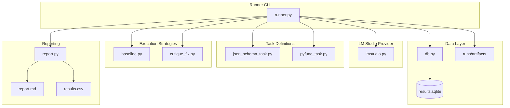

# Local Model Gauntlet Implementation Plan

## Architecture Overview



## Implementation Phases

### Phase 1: Project Initialization

Initialize the project with UV and set up the package structure:

- Run `uv init` to create `pyproject.toml`
- Add dependencies: `httpx`, `pydantic`, `sqlite-utils`, `pytest`, `rich`
- Create the `gauntlet/` package directory with `__init__.py`
- Create empty module files for the structure defined in the PRD

### Phase 2: Core Infrastructure

**2.1 Database Layer** - [gauntlet/db.py](gauntlet/db.py)

- Implement SQLite schema creation using `sqlite-utils`
- Create `runs` table (run_id, started_at, model, base_url, git_commit)
- Create `attempts` table (id, run_id, task_name, strategy_name, attempt_num, success, score, latency_ms, error_type, artifact_dir, created_at)
- Helper functions: `init_db()`, `insert_run()`, `insert_attempt()`, `get_attempts()`

**2.2 LM Studio Provider** - [gauntlet/providers/lmstudio.py](gauntlet/providers/lmstudio.py)

- Thin `httpx` wrapper for OpenAI-compatible API
- `LMStudioClient` class with configurable `base_url`, `model`, `timeout`
- `chat_completion(messages, temperature, max_tokens)` method
- Return structured response: text, raw JSON, latency_ms, token usage

### Phase 3: Task Implementations

**3.1 JSON Schema Task** - [gauntlet/tasks/json_schema_task.py](gauntlet/tasks/json_schema_task.py)

- Define `Person` Pydantic model (name, age, city)
- `get_prompt()` - returns system/user messages requesting JSON output
- `evaluate(response_text)` - attempts json.loads then Pydantic validation
- Returns: `{success: bool, score: float, error_type: str|None}`

**3.2 Python Function Task** - [gauntlet/tasks/pyfunc_task.py](gauntlet/tasks/pyfunc_task.py)

- `get_prompt()` - describes `normalize_phone()` requirements
- `evaluate(response_text, artifact_dir)`:
  - Extract code block from response (handle markdown fences)
  - Write `solution.py` and `test_solution.py` to artifact_dir
  - Run pytest as subprocess
  - Parse exit code and capture stdout/stderr
- Returns: `{success: bool, score: float, error_type: str|None, stdout: str, stderr: str}`

### Phase 4: Strategy Implementations

**4.1 Baseline Strategy** - [gauntlet/strategies/baseline.py](gauntlet/strategies/baseline.py)

- One-shot execution
- `execute(client, task, artifact_dir)` - single API call, evaluate, return result

**4.2 Critique-Fix Strategy** - [gauntlet/strategies/critique_fix.py](gauntlet/strategies/critique_fix.py)

- Two-step retry on failure
- `execute(client, task, artifact_dir, max_attempts)`:
  - Run baseline prompt
  - On failure: construct critique prompt with original + output + error
  - Retry with "Return ONLY corrected output" instruction

### Phase 5: Runner and CLI

**5.1 Runner** - [gauntlet/runner.py](gauntlet/runner.py)

- CLI argument parsing (argparse):
  - `--base-url` (default: http://localhost:1234/v1)
  - `--model` (default: liquid/lfm2.5-1.2b)
  - `--max-attempts` (default: 3)
  - `--run-id` (optional, auto-generate timestamp)
  - `--tasks` (optional, default: json,pyfunc)
  - `--strategies` (optional, default: baseline,critique_fix)
  - `--timeout` (default: 120)
- Main execution loop:
  - Create run_id and `runs/{run_id}/` directory
  - Insert run record to DB
  - For each (task x strategy): execute with artifact persistence
  - Save artifacts: prompt.json, response.txt, raw.json, eval.json
- Call report generation on completion

### Phase 6: Reporting

**6.1 Report Generator** - [gauntlet/report.py](gauntlet/report.py)

- `generate_report(db_path, run_id, output_dir)`:
  - Query attempts table for run
  - Calculate: pass rate per task/strategy, attempts-to-success, avg latency
  - Generate `report.md` with summary tables
  - Export `results.csv` from attempts table

## File Structure

```
gauntlet/
  __init__.py
  runner.py
  db.py
  report.py
  providers/
    __init__.py
    lmstudio.py
  tasks/
    __init__.py
    base.py           # Abstract task interface
    json_schema_task.py
    pyfunc_task.py
  strategies/
    __init__.py
    base.py           # Abstract strategy interface
    baseline.py
    critique_fix.py
runs/                 # Created at runtime
results.sqlite        # Created at runtime
pyproject.toml
```

## Execution Order

The implementation should proceed in dependency order to allow incremental testing:

1. Project setup (uv init, dependencies, directory structure)
2. Database layer (can test independently)
3. LM Studio provider (can test against running server)
4. Base interfaces for tasks/strategies
5. JSON schema task (simpler, no subprocess)
6. Python function task (more complex, subprocess handling)
7. Baseline strategy
8. Critique-fix strategy
9. Runner CLI integration
10. Report generation
11. End-to-end test run